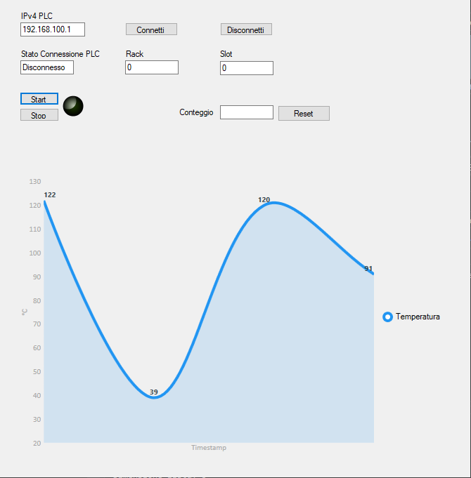

# greenhouse
The main goal of this project is to develop a greenhouse that complies with Industry 4.0 scenario.

This project is build with students of ITIS Galilei (San Secondo Parmense - PR).

## Scenario

### Hardware setup
**PLC**: Siemens S7 1200

**HMI**: Windows Form C# application

**ESP32**: used to put data into ThingSpeak analytics platform

### Software setup
* TIA Portal
* Visual Studio 2019

### Libraries
[Sharp7](http://snap7.sourceforge.net/sharp7.html): C# port of Snap7 client for interfacing with Siemens S7 PLCs

[Settimino](http://settimino.sourceforge.net/): library for interfacing ARDUINO / ESP8266 NodeMCU / ESP32 natively with Siemens S7 PLCs

[Eclipse Paho](https://www.eclipse.org/paho/index.php?page=clients/dotnet/index.php): library for interfacing HMI with ThingSpeak analytics platform

[LiveCharts](https://lvcharts.net/): real time data visualization for .NET library

### HMI

